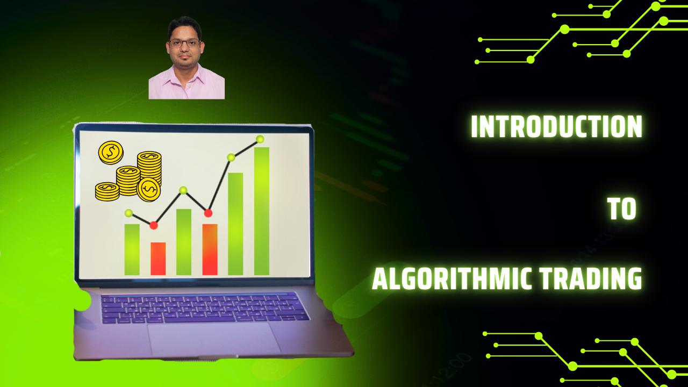
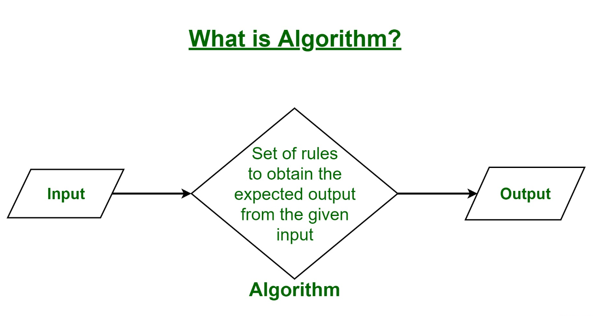
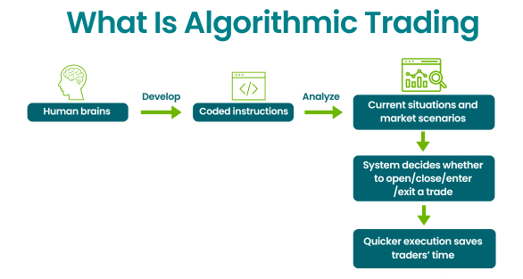
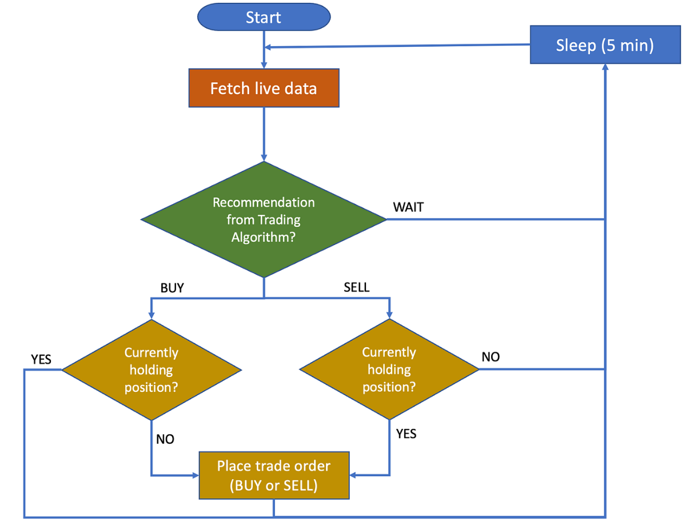

# Introduction To Algorithmic Trading

> This repository contains resources and code examples for algorithmic trading. Algorithmic trading involves using
> computer algorithms to automate trading decisions in financial markets. This can include strategies for buying and
> selling assets based on predefined criteria, such as price movements, volume, and other market indicators.

## Tools used

- Java
- Python
- IBKR API
- C++

## Table of Contents

1. [Algorithmic Trading Overview](https://github.com/backstreetbrogrammer/58_IntroductionToAlgorithmicTrading?tab=readme-ov-file#1-algorithmic-trading-overview)
   - Trading Algorithm 101
   - Trading Terminologies
   - Quant Trading 101
   - Fundamental Principles In Trading
2. [Setting Up Development Environment]()
3. [Single-Order Algorithms]()
4. [Multi-Order Algorithms]()
5. [Smart Routers]()
6. [Risk Assessment]()
7. [Performance Measurement]()
8. [High-Frequency Trading]()
9. [Statistical Arbitrage]()
10. [Other Trading Strategies]()

## Youtube

[Introduction To Algorithmic Trading playlist](https://www.youtube.com/playlist?list=PLQDzPczdXrTjU7O6HAKDgm_mLvlDqFl3Y)

---

## 1. Algorithmic Trading Overview

Algorithmic trading uses computer programs to execute trades based on predefined criteria.

It aims to optimize trading efficiency, reduce costs, and minimize human error.

Common strategies include trend following, mean reversion, and arbitrage.

### Trading Algorithm 101

Trading algorithms are codes designed to execute an order or orders, according to a predefined strategy.

In terms of simple flowchart, a trading algorithm can be represented as follows:

- **Input Market Data**: The algorithm receives real-time market data, including prices, volumes, and other relevant
  information.
- **Analyze Data**: The algorithm analyzes the incoming data using predefined rules and strategies.
- **Generate Signals**: Based on the analysis, the algorithm generates buy or sell or hold signals.
- **Execute Orders**: The algorithm executes the trades based on the generated signals.
- **Monitor Performance**: The algorithm continuously monitors the performance of executed trades and adjusts
  strategies as needed.
- **Output Results**: The algorithm provides feedback on trade outcomes and overall performance.
- **End Process**: The trading process concludes, and the algorithm awaits new market data to repeat the cycle.

There is another aspect of trading like **risk management** and **compliance** which is not covered here.

---

### Trading Terminologies

**What is a Stock?**

A type of security that signifies ownership in a corporation and represents a claim on part of the corporation’s assets
and earnings.

**Synonyms:** equity, shares, or equities.

**Why does a company issue stocks?**

**Answer:** to grow and make more capital

**Example:**

Suppose, I have made a **robot** which can do household chores (cleaning / laundry / kitchen etc.) and can replace a
domestic helper.

I shared this with my friends and relatives, and they all loved it. So, I used my spare room or garage to start a
small store to build and sell this robot.

Very soon, it became more popular within my vicinity, and thus I need to build more and more robots to meet the
demand.

The thought of manufacturing this robot on a large scale inspired me to start a company to manufacture and sell this
robot.

For this, I need capital (money) to buy machinery, raw materials, hire people, marketing etc.

If currently, I earn `100K` per year and `100%` owner of the store, to expand my business and start the company on a
bigger scale, I need `5M`.

I can take a loan from the bank, but I have no collateral to offer.

So, I decided to issue stocks (shares) of my company to raise capital.

I decide to issue `10M` shares of my company at `1$` each and give away `5M` shares to investors who give me `5M`
capital.

So I gave `50%` of my ownership to the investors via stocks / shares and now, I am the owner of `50%` of the stores
and also `50%` of profit.

---

**Types Of Trading Desks**

There are mainly two reasons to be involved in the markets:

- to invest/trade our savings, or
- to manage/trade other people’s money.

In both scenarios, our objective is to **make money**.

If we expand this concept to banks or hedge funds, we have two main trading desks:

- **Agency Trading Desk**: manages other people’s (client's) money, and
- **Proprietary Trading Desk**: manages the bank’s or hedge fund’s own money.

**Agency Trading**

In agency trading, a trader or trading desk executes trades on behalf of clients.

The trader acts as an intermediary between the client and the market.

**Objective:** The goal is to fulfill the client's orders efficiently, ensuring the best possible execution price.

**Risk:** The trader does not take on market risk since they are not trading their own money.

**Revenue:** The firm earns commissions or fees for executing trades.

**Example:** A brokerage firm executing buy/sell orders for retail or institutional clients.

**Proprietary (Prop) Trading**

In proprietary trading, a trader or trading desk uses the firm's own capital to trade in the market with the aim of
generating profits.

**Objective:** The goal is to maximize the firm's profits by taking calculated risks in the market.

**Risk:** The firm bears the full market risk, as it is trading its own money.

**Revenue:** The firm earns profits (or incurs losses) directly from the trades.

**Example:** A hedge fund or investment bank trading stocks, bonds, derivatives, or other financial instruments using
its own funds.

**Key Differences**

| Aspect             | Agency Trading                         | Proprietary Trading              |
|--------------------|----------------------------------------|----------------------------------|
| **Capital Used**   | Client's money                         | Firm's own money                 |
| **Risk**           | No market risk for the firm            | Full market risk for the firm    | 
| **Revenue Source** | Commissions/fees from clients          | Profits from trading activities  | 
| **Objective**      | Execute client orders efficiently      | Maximize firm's trading profits  | 
| **Role**           | Intermediary between client and market | Direct participant in the market | 

In summary, agency trading focuses on serving clients, while proprietary trading focuses on generating profits for the
firm.

### Quant Trading 101

### Fundamental Principles In Trading

